# Data-Flow Diagrams — Air Quality Monitor Firmware

> [!NOTE]
> All diagrams are derived from [PMS_DHT_2025_01_06.ino](file:///e:/CAPSTONE/PCB/PMS_DHT_2025_01_06.ino).
> Arrows show data movement; rounded boxes are processes; cylinders are stores; parallelograms are I/O.

---

## 1. `setup()` — System Startup

Runs **once** at power-on. Initialises every peripheral and establishes time.

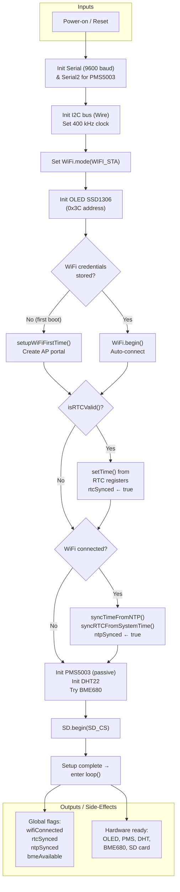

---

## 2. `loop()` — Main Program Loop

Runs **forever** after `setup()`. Orchestrates all subsystems with non-blocking `millis()` timing.

```mermaid
flowchart TD
    START(["loop() entry"]) --> MW["maintainWiFi()"]
    MW --> PNS["periodicNtpSync()"]
    PNS --> THROTTLE{"millis() − last<br>≥ 1 000 ms?"}
    THROTTLE -- "No" --> RETURN(["return"])
    THROTTLE -- "Yes" --> GPS["Set fixed GPS<br>coordinates"]

    GPS --> PMS_CHK{"millis() − lastPmsRead<br>≥ 2 000 ms?"}
    PMS_CHK -- "Yes" --> PMS_READ["readPMSSensor()"]
    PMS_CHK -- "No" --> DAY_CHK
    PMS_READ --> DAY_CHK

    DAY_CHK{"getRTCDate()<br>≠ lastFileDate?"}
    DAY_CHK -- "Yes" --> NEW_FILE["checkFileExists()<br>lastFileDate ← today"]
    DAY_CHK -- "No" --> SENSE
    NEW_FILE --> SENSE

    SENSE["readSensors()"] --> AQI["calculateAQI()"]
    AQI --> TIME["dateTime ← getRTCDateTime()<br>Date ← getRTCDate()"]

    TIME --> DISP_CHK{"millis() − lastDisplay<br>≥ 3 000 ms?"}
    DISP_CHK -- "Yes" --> DISP["updateDisplay()"]
    DISP_CHK -- "No" --> AQI_CHK
    DISP --> AQI_CHK

    AQI_CHK{"millis() − lastAqiDisp<br>≥ 5 000 ms?"}
    AQI_CHK -- "Yes" --> AQI_DISP["updateAQIDisplay()"]
    AQI_CHK -- "No" --> SD_CHK
    AQI_DISP --> SD_CHK

    SD_CHK{"millis() − lastSDLog<br>≥ 10 000 ms?"}
    SD_CHK -- "Yes" --> SD_LOG["logDataSdCard()"]
    SD_CHK -- "No" --> DBG
    SD_LOG --> DBG

    DBG["Serial.println<br>data cycle info"] --> RETURN
```

---

## 3. `readSensors()` — DHT22 + BME680 Reading

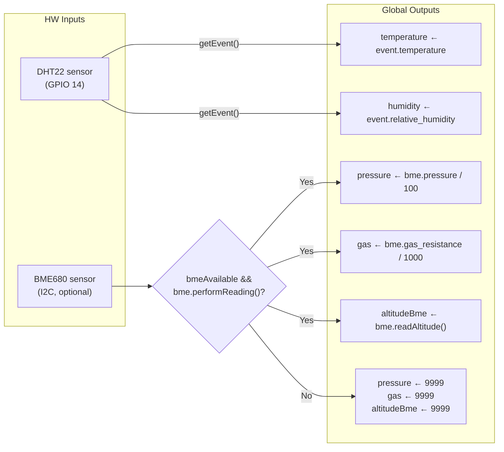

---

## 4. `readPMSSensor()` — PMS5003 Air Quality Reading

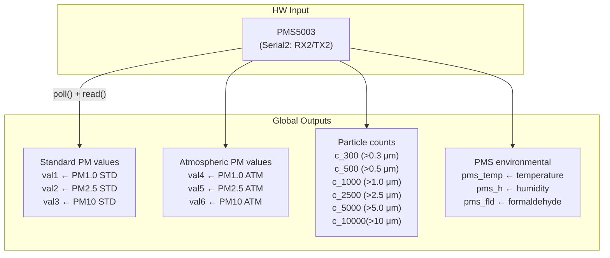

---

## 5. `calculateAQI()` — PM2.5 → Air Quality Index

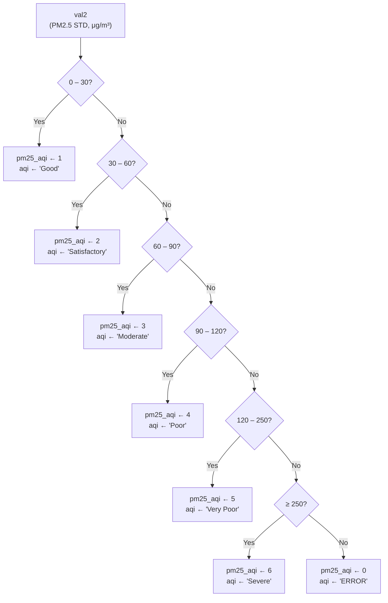

---

## 6. `updateDisplay()` — OLED Sensor Screen

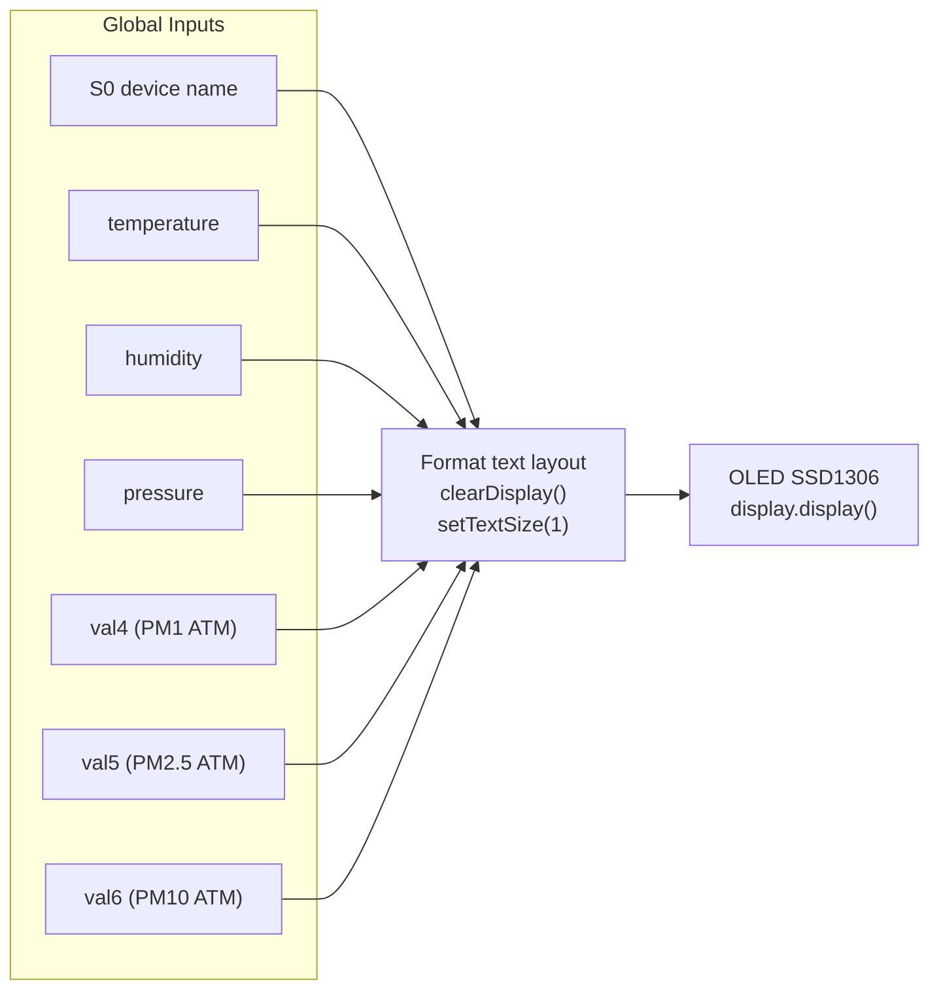

---

## 7. `updateAQIDisplay()` — OLED AQI Screen

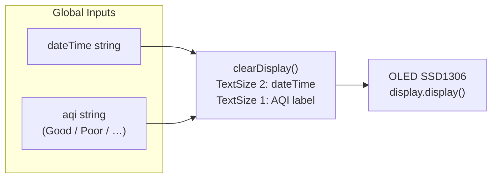

---

## 8. `checkFileExists()` — Daily CSV File Creation

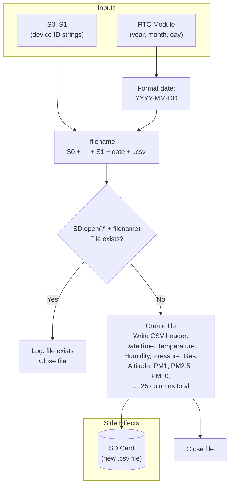

---

## 9. `logDataSdCard()` — Append Sensor Row to CSV

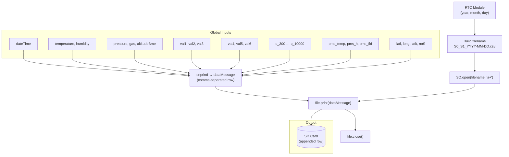

---

## 10. `syncTimeFromNTP()` — Internet Time Sync

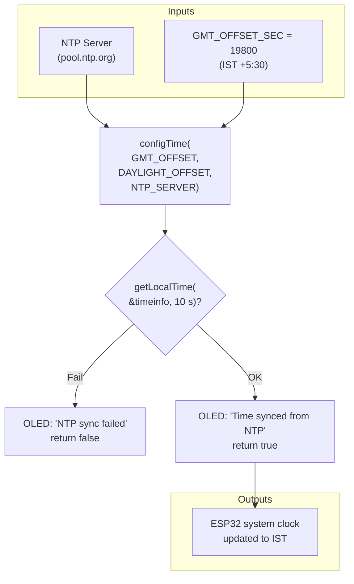

---

## 11. `syncRTCFromSystemTime()` — Write System Clock → RTC

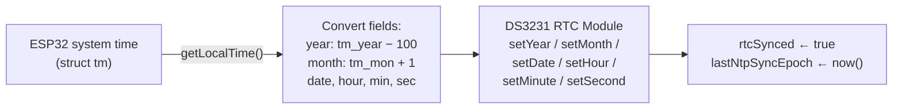

---

## 12. `setupWiFiFirstTime()` — WiFi Captive Portal

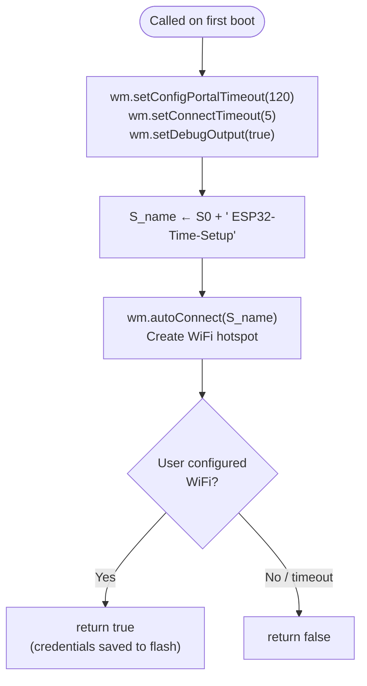

---

## 13. `isRTCValid()` — RTC Sanity Check

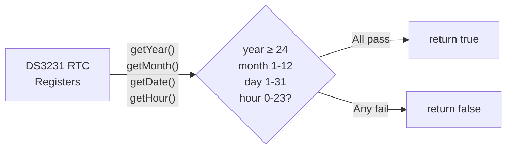

---

## 14. `getRTCDateTime()` — Formatted Date-Time String

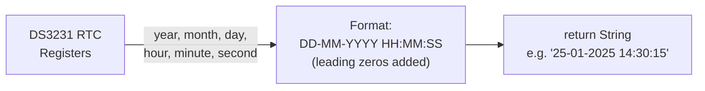

---

## 15. `getRTCDate()` — Date-Only String

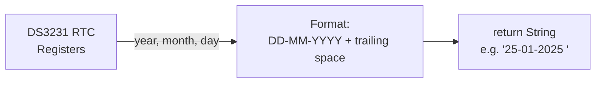

---

## 16. `maintainWiFi()` — WiFi Connection Manager

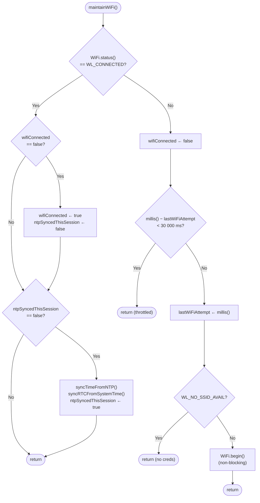

---

## 17. `periodicNtpSync()` — 24-Hour Time Correction

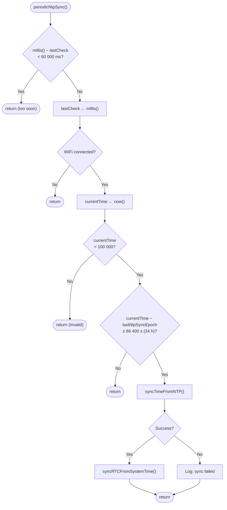

---

## 18. Utility helpers: `daysInMonth()` / `isLeapYear()`

These are pure functions with no side-effects — included for completeness.

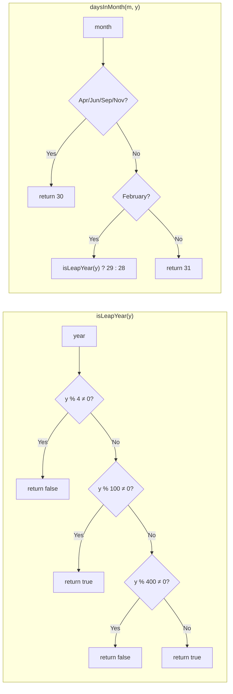

---

## Global Data-Flow Overview

This final diagram ties all functions together showing the full data lifecycle:

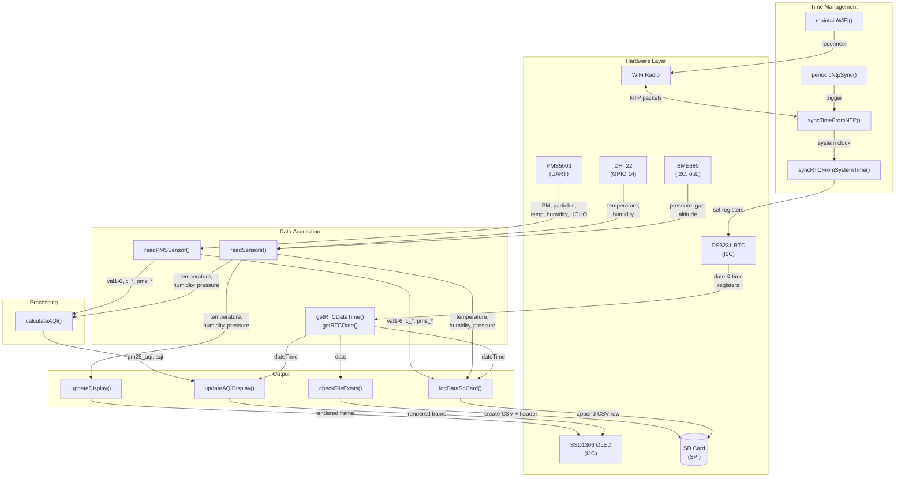
